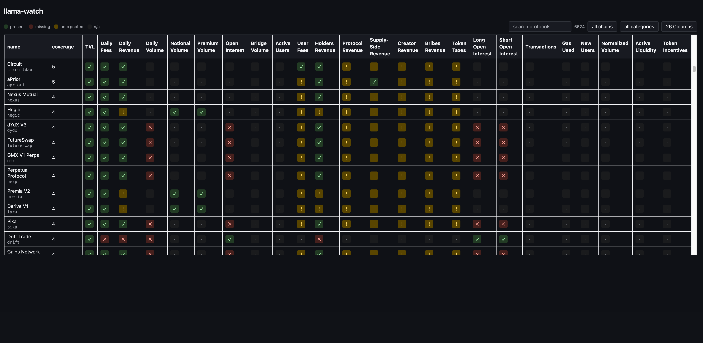
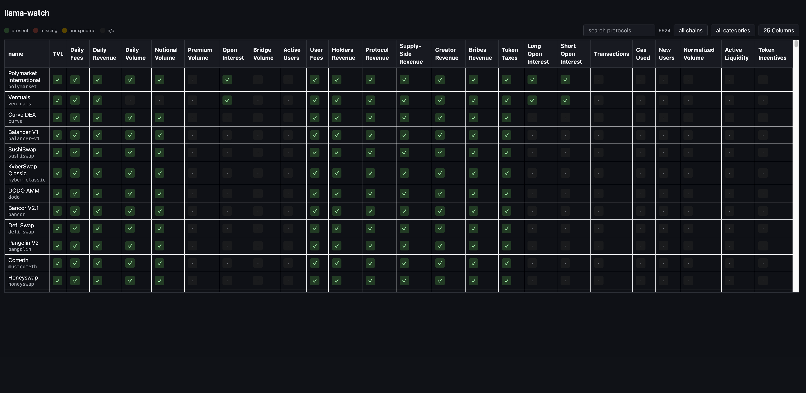
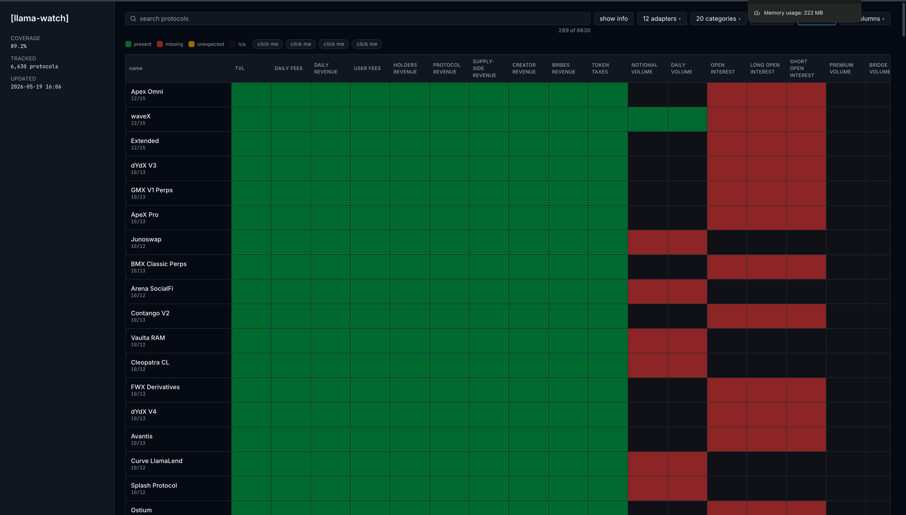
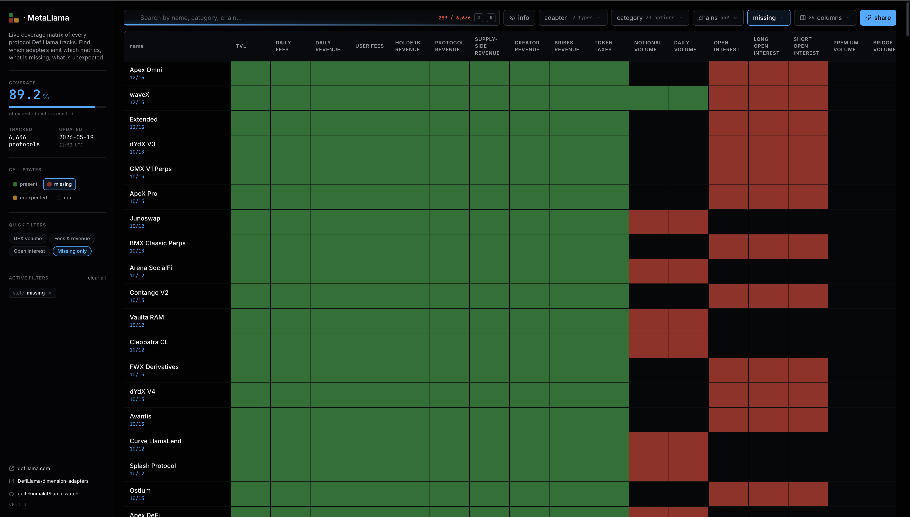

# v1
> cutoff commit: ce7ab6e628d3aa0f1a2bc6b266a649be0f709dce

## Backend
- Bootstrapped from the [hardhat-go template](https://github.com/gultekinmakif/go-http-server).
- **Keyword coverage parser.** Walked the cloned adapter source trees and regex-grepped `.ts` / `.js` files for `dailyFees`, `dailyVolume`, and the rest to infer per-adapter metrics. Sunset in v2.
- **`cmd/refresh` orchestrator.** Shallow-cloned upstream, ran the walker, persisted `matrix` + `protocol_identities`. Skipped the pipeline when upstream SHAs were unchanged.
- **Read surface.** `/health` with a 2s Postgres ping, plus `/api/matrix`, `/api/matrix/{slug}`, `/api/chains`, `/api/dimensions`.
- **Bash orchestrator.** `scripts/refresh.sh` plus `scripts/setup-cron.sh` for scheduler install.

## Data Pipeline
The v1 pipeline was Go-only: clone, walk, classify, persist.

1. **Sparse-clone** `DefiLlama/defillama-server` into `var/upstream/`, scoped to `defi/src/protocols`.
2. **Walk the adapter trees** for known metric keys (`dailyFees:`, `tvl:`, ...) to infer presence per `(protocol, metric)`.
3. **Build the matrix in memory.** One row per `(slug, metric)`, plus a sibling `protocol_identities` row.
4. **Persist** in one transaction: truncate both tables, bulk-insert from the walker output.
5. **Serve.** `cmd/server` reads the matrix at request time, normalized by the pinned registry column order.

The walker over-matched comments and missed re-exports. v2 swapped source-scanning for upstream's own metric manifests.

## Web UI
- Next.js 16 + React 19 + Tailwind 4 + `@tanstack/react-table` + `@tanstack/react-virtual`. Static export into `web/out/`; the Go server's file root serves it.
- URL is the source of truth for sort, filter, column visibility, search query, so any view is a shareable link.
- Per-protocol detail route (`/protocol/<slug>`) with a static-export-friendly page-per-protocol via `generateStaticParams`.

# v2
> cutoff commit: 6511fbb91d7ddb54757826ae69663c19661c90e9

### Backend
- **Sunset the keyword walker.** `internal/dimensions/` is deprecated. Coverage derives from upstream's `tvlModules.json` + `dimensionModules.json` release manifests.
- **`tools/` bun TS pipeline.** `extract-protocols.ts` normalizes the catalog; `build-snapshot.ts` joins it against both manifests via the dimType bundle map.
- **`internal/registry/` became the single source of truth.**
- **Four-state cell classifier.** `ClassifyCell` returns `na` / `present` / `missing` / `unexpected`.
- **`cmd/sync-db` Go bulk loader.** One transaction: truncate, bulk-insert in batches.
- **`GET /api/metrics-coverage`.** Per-metric aggregate over `matrix`.

### Data Pipeline
The v2 pipeline is **manifest-driven**: bash fans out, bun joins, Go persists.

1. **Parallel upstream fetches.** Sparse-clone `defillama-server`; `curl` `tvlModules.json` and `dimensionModules.json` from the latest releases.
2. **Normalize the catalog.** `bun tools/extract-protocols.ts` flattens `data{1..6}.ts` into `protocols.json`.
3. **Build the snapshot.** `bun tools/build-snapshot.ts` joins the catalog against both manifests via `presets.json`. Gates on TVL adapter presence; first-seen wins when dimTypes overlap on a metric. Writes `var/snapshot/snapshot.json`.
4. **Persist.** `bin/sync-db` truncates `matrix` + `protocol_identities` and bulk-inserts in one transaction.
5. **Stage the frontend.** `bun run build` into a sibling stage, atomic-swap `web/out/`.

### Web UI
- **Four-state cells.** Black / green / red / yellow. Legend doubles as a row filter via `?cellState=...`.
- **Sidebar shell.** Brand, hero strip, legend, preset pills, active-filters chips, footer. Mobile drawer with backdrop.
- **Preset pills.** One-click `category` + `adapter` filters that narrow rows and columns together.
- **Hero strip.** Tracked / Coverage / Updated KPI subgrid above the matrix.
- **Search box.** `match-sorter` over name, slug, category, chains. Debounced and deferred, with a focus hotkey.
- **Share button.** Copies the live URL with every active filter and sort baked in.
- **Scroll-to-top.** Floating accent button after the first viewport.
- **Token palette.** Colors moved to oklch tokens in `@theme`.
- **Version footer chip.** Build-time git SHA, links to the GitHub commit.

## v2.0.2
- **Matrix in its own scroll region.** Sticky thead and name column anchor to the wrapper, not the page. Sidebar and toolbar stay put on scroll.
- **`cellState` filter respects visible columns.** `present` + `active-users` now matches only on that column, like `chain` and `category` already do.
- **Quick-filter presets rebuilt.** Five gap-audit shortcuts: `Missing fees on Ethereum`, `DEXs missing volume`, `Perps missing OI`, `Bridges missing fees`, `Active users coverage`.
- **Release pipeline.** A PR from `release/vX.Y.Z` to main auto-tags the release, publishes the GitHub release page, and rebuilds Vercel. Version lives in `web/version.json`.

## v2.1.0
- **Coverage mode toggle.** Sidebar chip flips the matrix between dimType-bundle scoring (default) and category-based scoring (`?mode=dimensions`), with the headline coverage % and caption following the active mode. The alt mode surfaces protocols missing dimension adapters per category.
- **`CATEGORIES_EXPECTED` expanded.** Every category in the live snapshot now has a curated expected set, derived empirically via the new `tools/derive-categories.ts`. Re-runnable against future snapshots.
- **`info` URL param.** Identity columns (category / chains / coverage) controlled by `?info=true|false` instead of bloating `cols=`. Visible by default.
- **Refresh script.** `--soft` flag (and `make refresh-soft`) reuses on-disk upstream files for fast re-classification. Structured banners with sizes and timing per phase.
- **refactor.** Vitest in CI, mobile drawer announces itself and manages focus, `/` hotkey skips textareas and contenteditable, sort cycle no longer hides columns, dead `ScrollToTop` removed...

# v3
> cutoff commit: None yet.
  
## Backend
- [ ] **Eliminate `tools/` by porting to Go.** Drop the bun dependency; fold `extract-protocols` + `build-snapshot` into a Go binary.
- [ ] **Direct GitHub fetch instead of sparse clone.** Pull `data{1..6}.ts` from `raw.githubusercontent.com`. Kills the `git` + `rsync` dependency.
- [ ] **TVL ingest + sort.** Pull per-protocol TVL from the DefiLlama API each refresh. Unlocks sort-by-TVL and the v4 sparkline.
- [ ] **Historical snapshots table.** Keyed by `(date, slug, metric)`. Daily cron, 30-day backfill from upstream git history.

## Data Pipeline
- [ ] **Single Go binary owns the refresh.** Fetch → normalize → snapshot → sync → write history. No bash, no bun.

## Web UI
- [ ] **Historical day selector.** `?date=YYYY-MM-DD` renders the matrix as of that day.
- [ ] **Graphs / stats page.** `/stats` route. Line charts for tracked protocols, chains, metrics, and coverage rates over time.

# v4
> cutoff commit: None yet.
<!-- Unplanned. Skim and re-order into v3/v4 manually. -->

## Backend
- [ ] **`/api/stats` endpoint.** Feed the hero strip from the DB instead of the snapshot.

## Data Pipeline
- [ ] **Year-scale history.** Same schema as v3, **longer backfill,** partition the table.

## Web UI
- [ ] **Sparkline per row.** Inline TVL chart. Depends on TVL ingest + v3 history.
- [ ] **`PresenceBadge` primitive.** Collapse matrix `PresenceCell` and detail-page pill.
- [ ] **`useCsvParam` hook.** Read-side companion to `useReplaceParams`.
- [ ] **A11y polish.** `aria-hidden` on absent cells; `aria-live` on the search count.
- [ ] **Light theme toggle.** Out of scope today; parked here so it doesn't get lost.

# UI PROGRESSION
### v1.0
Coverage came from a Go regex-grep over `.ts` adapter files.
Comment matches and re-export misses produced false-positive 'unexpected' cells everywhere.

### v1.1
Regex tightened; false positives are gone:

### v2.0
Comparison with dimension-adapters via upstream's `dimensionModules.json` release manifest.

### v2.1
Design pass by Claude.

